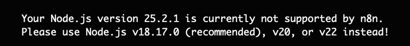
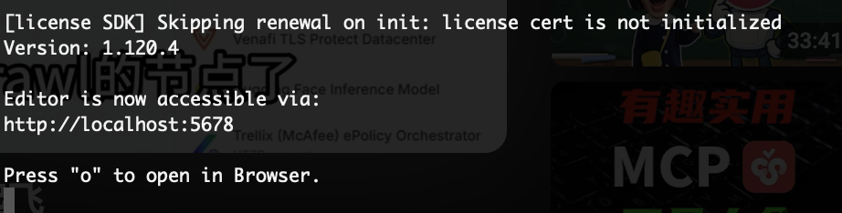
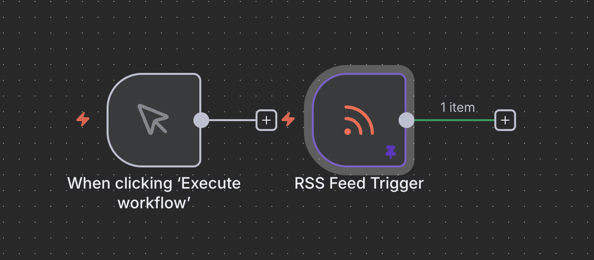

## 安装n8n
### 首先npx install n8n

此处要注意nodejs 的版本，不能太高。

否则就会出现

使用nvm切换一下版本就ok（强烈建议使用nvm，不使用nvm手动切换十分麻烦）
安装好后直接访问下面的网址就行

## 构建RSS节点，然后AI分析

首先选择

因为我们要单点执行
然后选择RSS Feed
输入RSS 订阅地址如https://hnrss.org/newest?points=100
结果如图

我这里pin了RSS Feed的结果，这是防止每次都需要走一遍fetch过程
接下来我们需要使用爬虫去爬网页，然后总结内容
爬虫使用firecrawl，这个需要去找社区的插件
## 构建自动化去水印

