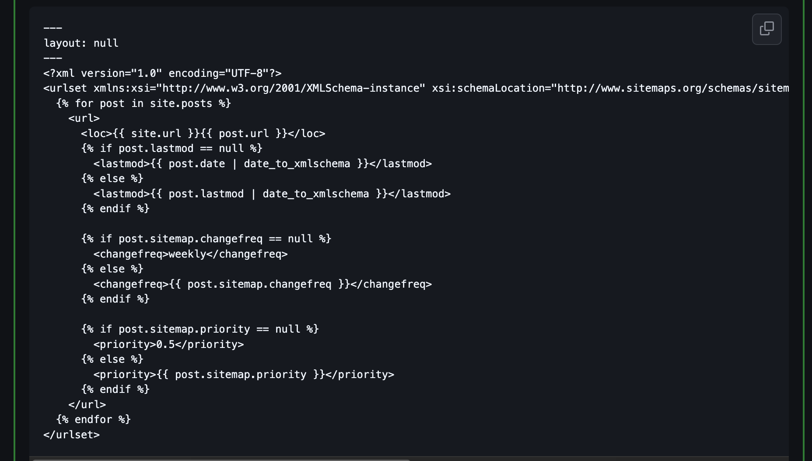

我对于blog的配置主要都是参考https://winxuan.github.io/posts这位大佬的。

这里加一点，注意在根目录下面用这个文件配置[sitemap](https://github.com/cotes2020/jekyll-theme-chirpy/discussions/1815)，这样就不用再去专门更新sitemap了。

(ps: 这里我放图片不放代码的原因是我不知道为什么，贴上源代码，居然会自动转换成我自己的sitemap，可能和jekyll有关。)

这里只放一个索引，跟着走应该没问题
1. [配置google search](https://winxuan.github.io/posts/blog-google-search-include/)
2. [配置bing search](https://winxuan.github.io/posts/blog-bing-search-include/)
3. [开启google analytics](https://winxuan.github.io/posts/add-google-analytics/)
4. [开启cdn](https://winxuan.github.io/posts/blog-img-add-cdn/)
5. [配置giscus](https://winxuan.github.io/posts/config-blog-comment/)
	
	注意这里需要先安装giscus app，博客里面漏掉了这一点，点击
	
	
	下面这个蓝色的giscus。跳转后根据提示安装就行.
	 安装完之后，记得填_config.yml里面的字段，尤其是不要漏了

	 这里的字段
