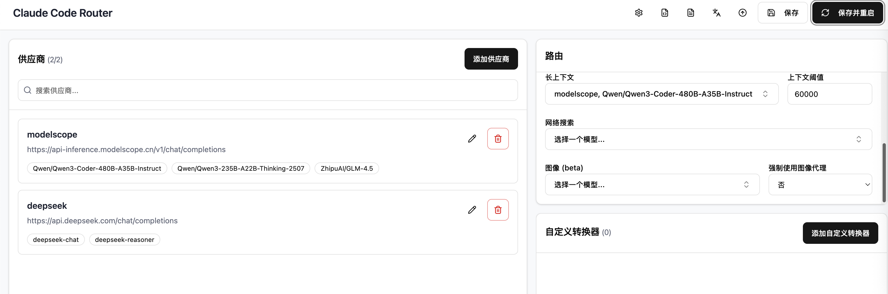

有一个项目是https://github.com/musistudio/claude-code-router， 下面简称ccr，这个开源项目主要是解决claude API太难搞的问题。

可以配置国内的模型来使用claude code。 

## 正式开始
首先要下载 [Claude Code](https://docs.anthropic.com/en/docs/claude-code/quickstart) :

```shell
npm install -g @anthropic-ai/claude-code
```

然后安装Claude Code Router:

```shell
npm install -g @musistudio/claude-code-router
```

下面为了配置方便，在命令行中输入
```shell
ccr ui
```
进入这个页面

你的页面肯定跟我的不一样，因为我已经配置了。

点击添加供应商，然后用模版，输入对应的Key就好。转换器不写也可以。
最后要点击右上角保存并重启

下面给几种选择：
1. 配阿里的Qwen3
	访问[魔塔社区](https://modelscope.cn/my/overview)， 登陆完之后绑定阿里云账号，然后再搞一个API key。
	每天2000个额度
2. 配GLM4.5，貌似挺便宜
3. 配Deepseek
4. Gemini


## 重点是Gemini
我们接下来会介绍怎么搞这个无限Gemini，Gemini目前可以免费调用3.0 pro，但是额度太少，我们加一个负载均衡就OK。

已经有人干了，https://github.com/snailyp/gemini-balance，
我们先搞十个谷歌账号


## 下面介绍四个claude code常见的命令：
/init，这个是初始化你的项目，具体来说就是把你项目所有的文件都给claude code，然后它对你这个项目就有了解了，接着会生成一个md文件。每次你问他问题他都会把这个文件带上。
/compact，这个是压缩上下文，因为你每次交谈都会把之前的交谈记录作为上下文传上去，那太耗额度了。用这个办法省点钱。
/clear，清除上下文，开启新一轮对话
/ide，用IDE，摆脱命令行. 但是貌似不能直接用IDE的插件沟通，只能在ide里面看，命令行里面对话。


## 模式也有三种
plan模式， 只做计划不写代码
auto accept， 写代码并且自动接收
manual accpet，写代码交给你来决定是否accept
