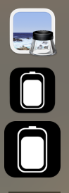

项目链接：https://github.com/Vossera/battery-plus

我最近给一个开源项目写了一个GUI增强版。但是由于原作者是极简主义者，不接受任何GUI的修改，以保持GUI是最小功能。所以我fork，修改了之后只提了一个小PR（关于dock里面图片大小的）。

## Battery-Plus是什么
这是一款电源管理软件，如果长时间使用Mac，插电使用比不插电使用对电池寿命更好。因为插电使用可以设置不给电池充电，而适配器直接给电脑供电。 从了解了MAC电源管理后，去找了对应的软件：Aldente，这个软件收费（免费版也能用，但是我看见提示更新到Pro就很不爽😕） 后来了解到Battery 这个项目，发现自带的CLI工具非常强大，但是GUI界面比较简单，只支持一个最简单的Battery Limit功能 Battery源项目不接受GUI更改。因此诞生了Batter-Plus
### 这个项目增加了什么？
- Battery Limit：20%-80%
- Battery Charging: On/Off
- Force-Discharging: On/Off
- Calibration
### 为什么这么增加？
- **Battery Limit：20%-80%** 能够更方便的控制电源的值，支持自定义，默认80%
- **Battery Charging: On/Off** 决定电源是否能充上电
- **Force-Discharging: On/Off** 决定是谁来供电（电源还是电源适配器），如果打开,那么就是电源供电，这在Clamshell，desktop closed with 外接显示器 的时候可能不起作用。（合盖模式下使用外接显示器通常需要更高的功耗,如果强制使用电池供电可能导致电源压力太大。 MacOS可能从硬件上阻止这种操作。）
- **Calibration**： 这个是校准电源的，因为使用电源管理工具，系统电量会停止更新，而电池是存在自动放电的，因此需要校准，这个校准可能会耗时几个小时。
## 我对源项目提的一个小PR
### 为什么要提
如你所见，上面上我修改后的，下面是没修改的。

  

### 怎么修改的呢
将文件上传到https://www.candyicons.com/free-tools/app-icon-assets-generator这个网站上。
然后下载1024 * 1024的图片，就能给图片加上padding，让他看起来更小。

详细思路可见这里的讨论：https://juejin.cn/post/7393533304505073715

Mac的图标是需要留白的。