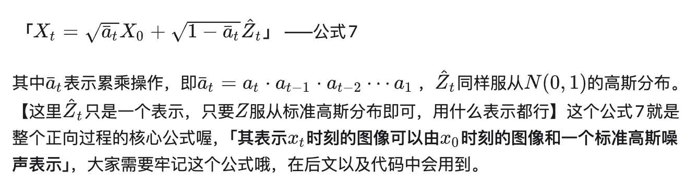
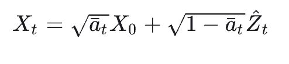
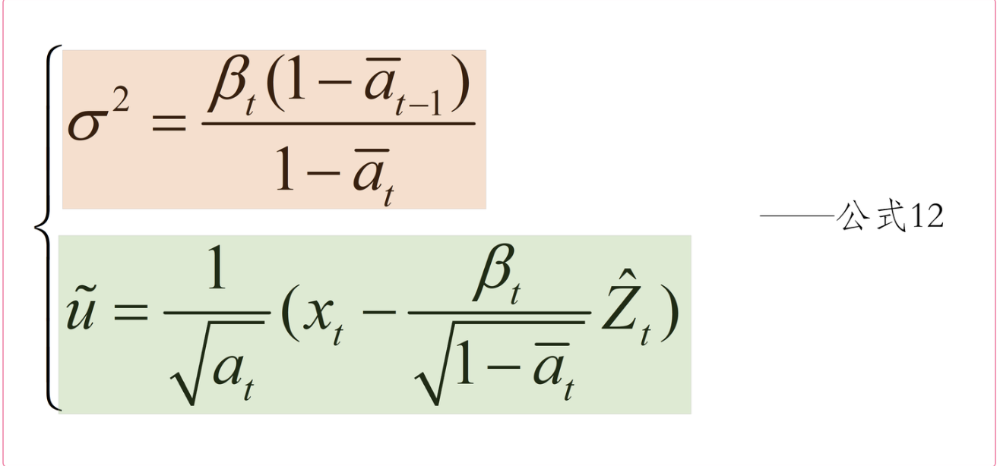

主要分为正向过程和逆向过程，正向过程类似于编码，逆向过程类似于解码。

正向过程加噪声的过程必须加高斯噪声，因为后面运算需要高斯噪声的一些特性，而且噪声是越加越多的。因为一开始图像比较清晰，只需要少量噪声就能扰动，后来图像不清晰，需要加很多噪声才行。
首先，我们会随机生成一个服从高斯分布的噪声图片，然后一步一步的减少噪声直到生成预期图片。

## 正向过程

## 反向过程

就是贝叶斯公式，然后再上一个条件变量

对高斯分布进行乘除运算的结果仍然是高斯分布

想手推公式去看https://zhuanlan.zhihu.com/p/610505558

这个是正向的过程

这个上反向过程估计出来的$X_{t-1}$ 的高斯分布的均值和方差

训练我们需要有真实值和预测值，那么对于本例的真实值和预测值是什么呢？真实值是我们输入的图片，预测值是我们输出的图片吗？其实不是，这里我就不和大家卖关子了。对于本例来说，真实值和预测值都是噪声，我们同样拿下图为大家做个示范。

训练与采样的区别？

训练时搞一个噪声

采样好像是跟反向有关？

网络学习的实际上是符合标准高斯分布的Zt，所以我有点理解不了那还要网络学习什么，标准高斯分布不是已经知道了吗？
**条件生成（Conditional Generation）**：模型在生成数据时需要根据给定的条件来决定生成的内容
**非条件生成（Unconditional Generation）**：与之相对，非条件生成指的是模型在没有任何外部条件的情况下生成数据。模型只是简单地从其学习到的数据分布中采样，生成样本。这种生成方式不依赖于任何特定的输入条件。

在扩散模型中，每一步的输入是带有一定噪声的图像（从完全随机噪声开始逐步还原），网络的任务是从这个带噪声的图像中预测出当前步骤的噪声

与AI的对话：
1. 为什么DDPM不能减少步数？
	这在数学上是多峰分布的问题，因为如果你把一个噪声视作起始，然后要求一步生成图片，这就导致会有多种选择，模型不知道该怎么办。
2. DDPM 之所以慢，是因为它被建模为一个**随机漫步（Random Walk）**。
	DDIM 做了一个关键的改动：它把逆向过程变成了“确定性”的。在 DDIM 的公式中，它去掉了每一步注入的随机噪声（让方差 $\sigma = 0$）。这意味着，只要给定初始噪声 $x_T$，生成的轨迹就是**固定**的。
	所以DDIM可以把步子设置的更大一点
3. 扩散模型的训练本质上是一个**自监督（Self-Supervised）**的过程。我们不需要人工标注数据，只需要原图和一堆高斯噪声。
	想象我们是老师，模型是学生，我们在玩一个“找茬”游戏：

	**前向加噪（Forward Diffusion）**：
    - 我们拿一张高清图 $x_0$（比如一张猫）。
    - 随机选一个时间点 $t$（比如 $t=500$）。
    - 根据 $t$ 往图上叠加对应强度的标准高斯噪声 $\epsilon$，得到一张噪点图 $x_t$。
    - **关键点**：这步是纯数学计算，不需要神经网络，瞬间完成。
	**模型预测（Model Prediction）**：
    - 我们将这张噪点图 $x_t$ 丢给神经网络（通常是一个 **U-Net**）。
    - 我们要求网络回答一个问题：“请告诉我，这张图里具体包含了什么样的噪声？”
    - 网络的输出记为 $\epsilon_\theta(x_t, t)$。
	**计算损失（Loss Calculation）**：
	- 因为是我们自己加的噪声，我们手里有标准答案 $\epsilon$。
	- 我们直接对比**网络猜的噪声**和**真实添加的噪声**，计算它们之间的差距（通常用 MSE 均方误差）。
	- $Loss = ||\epsilon - \epsilon_\theta(x_t, t)||^2$
- 只要不断重复这个过程，网络最终就会变成一个**“噪声鉴赏大师”**：给它任何一张带噪的图，它都能精准地把里面的噪声成分提取出来。

4. 采样过程 (Sampling)：利用“噪声预测”来去噪
	训练好了这个“噪声鉴赏大师”（U-Net），我们就可以用它来生成图像了。这里就是 DDPM 和 DDIM 分道扬镳的地方。
	
	**共同的第一步**：随机生成一个纯噪声 $x_T$。
	**接下来是循环迭代（从 $T$ 到 $0$）：**
	把当前的图 $x_t$ 和时间 $t$ 喂给训练好的 U-Net。
	U-Net 预测出图里的噪声 $\epsilon_\theta$。
	**做减法（去噪）**：
	- **DDPM 的做法**：$x_{t-1} = \frac{1}{\sqrt{\alpha_t}} (x_t - \text{系数} \cdot \epsilon_\theta) + \sigma_t z$
        - 这里减去一部分预测的噪声，然后**必须**再加上一点点新的随机噪声 $z$（Langevin 动力学）。
    - **DDIM 的做法**：$x_{t-1} = \text{公式变种}(x_t, \epsilon_\theta)$
        - 它利用预测出的噪声，直接通过非马尔可夫链的公式指向 $x_{t-1}$，**不加**任何随机噪声。
	- 这里为什么要加一点点新的随机噪声？
	- 从概率角度看，逆向过程 $p(x_{t-1}|x_t)$ 本身就是一个**高斯分布**，而不是一个固定的值。
	- 如果我们只取均值（不加噪声），我们实际上是在做“最大似然估计”，这会丢掉方差信息。
	- 加上 $\sigma_t z$，我们才是在从这个分布中**采样**。采样的意思是从噪声中复原图像。
4. DDIM
	在 DDIM 中，每一个随机噪声 $x_T$ 都**一一对应**着一张特定的图像。这赋予了模型很多高级能力，比如**图像编辑**（我们可以把一张现有的图反推回噪声，修改一点点，再生成回来）
	DDIM 的轨迹虽然确定，但它是由扩散方程推导出来的，通常是一条**弯曲的弧线**。
	**Flow Matching**（以及 Rectified Flow）的核心思想非常简单粗暴：
> 	既然我们要从噪声分布（$x_T$）映射到图像分布（$x_0$），为什么非要走扩散模型规定的那条弯路呢？我们能不能直接训练模型去走两点之间**最短的路径——直线**？
	这就好比你要从山顶滑雪到山脚：
	- **DDIM**：沿着蜿蜒的盘山公路滑下来（虽然不抖了，但路程长）。
	- **Flow Matching**：直接修一条笔直的索道，直达终点。

5. 在 DDPM/DDIM 中，U-Net 实际上是在预测**噪声 ($\epsilon$)**，也就是告诉我们“这张图里有多少杂质”。
	而在 Flow Matching 中，既然我们假设数据是在做“匀速直线运动”从噪声变成图像，那么这就变成了一个物理运动问题。

	在 Flow Matching 中，我们提到的“速度”（Velocity），指的其实是**向量场（Vector Field）**。
	
- **DDPM** 就像是一个在迷雾中完全靠随机游走（加一点趋势）慢慢摸索回家的过程。
- **Flow Matching** 则是我们强行在这个空间里建立了一条**笔直的通道**。有匀速直线运动，也有线性插值。
- 我们要训练一个神经网络 $v_\theta(x_t, t)$，它的任务是：**只要给它一个中间状态 $x_t$，它就要能把这个“速度”预测出来。**
	假设在训练数据中，有两个不同的噪声起点，比如 $x_{1a}$ 和 $x_{1b}$，它们最终都对应**同一个**目标图像 $x_0$（比如都是生成同一张猫的图）。
	
	根据公式 $v = x_0 - x_1$，这两个起点的“速度”方向会是一样的吗？还是会像车轮辐条一样汇聚到中心？
	这里有一个很关键的反直觉点：**它们的方向通常是不同的**。
	模型 $v_\theta(x_t, t)$ 学到的不是某一条固定的路，而是一张**“全图导航”**。无论你把数据点扔在空间的哪个位置，模型都能根据它学到的向量场，给出一个指向正确目标（或其概率分布中心）的箭头。

- **训练时**：我们强迫模型去学习一条连接噪声 $x_1$ 和图像 $x_0$ 的**直线**轨迹（Linear Interpolation）。
- **推理时**：我们用欧拉法来解这个方程。
- flow matching是插值的，训练时随机加噪声，但是只加一次，这迫使模型去学习那个“全图导航”的向量场，而不仅仅是记住了某一条路径。
- 但是模型可能不够完美，我们多次算速度其实就相当于微调