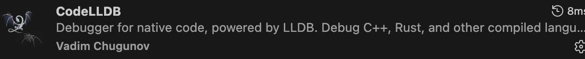

1. 购物车，其实就是01背包，状态转移复杂一点，先用一个三元组保存输入，c++中三元组是tuple. 注意dp的定义和主件的定义是不一样的。
	我在用vscode debug c++的时候，一开始使用原生的插件发现怎么配置launch.json都不行，永远无法弹出一个terminal让我去输入数据，最后下载了一个插件，Code LLDB，配置完之后解决
	
2. 小人移动
	c++中的split函数是StringSpliter（string，delimiter）
	stringsteam在sstream 里面
	
``` c++
	string input;

	cin >> input;
	
	stringstream ss(input);
	
	string token;
	
	vector<string> tokens;
	
	while (getline(ss, token, ';')) {
	
	tokens.push_back(token);
	
	}
	
	for (auto temp : tokens) {
	
	cout << temp << endl;

}
```
	这题我用的是状态机，但是其实正则过滤也可以。
		`regex_match(string,**regex**(``"[0-9]*"``))`. 这里是说string是否全是数字，如果不是全数字就退出.第二个传的是regex这个对象
		string temp = token.substr(1); 取的是下标从1开始的字符串. 调用substr一定先判断长度, str.length()