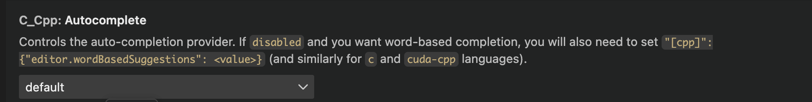
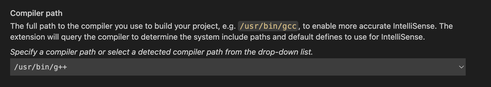

vscode连接服务器c++总是抽风，没有intelli sense或者语法高亮。

花了点时间研究一下，关键在于
## 1. 

这里不能用默认的x64.
## 2. 

这里不能disable了
## 3. 

这里不能是gcc,因为我们写的是c++代码而非c代码.


# CUDA Debug

### 可以用vscode自带的shift +f5
tasks.json这么写
```c
"type": "cppbuild",

"label": "nvcc: build active file",

"command": "/usr/local/cuda-11.1/bin/nvcc",

"args": [

"-g",

"${file}",

"-o",

"${fileDirname}/${fileBasenameNoExtension}"

],
```


关键是换个编译器，nvcc就行。cuda-gdb不用，貌似可以用gdb debug cuda代码


### 也可以用cmake
https://fancyerii.github.io/2024/01/17/vscode-cuda-debug/#%E5%88%9B%E5%BB%BAcmake%E9%A1%B9%E7%9B%AE

参考他的就行